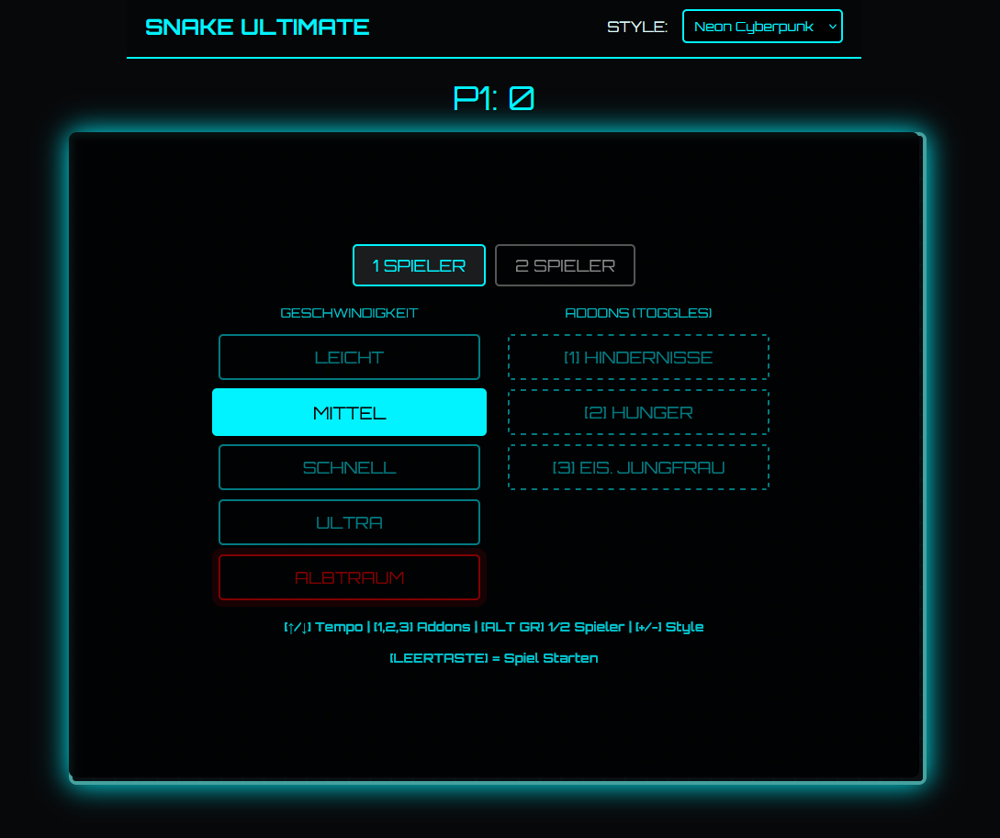
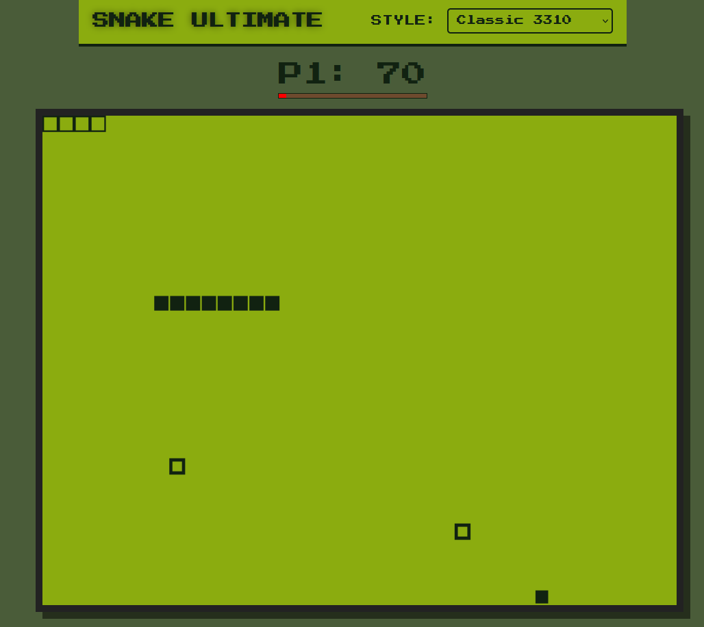
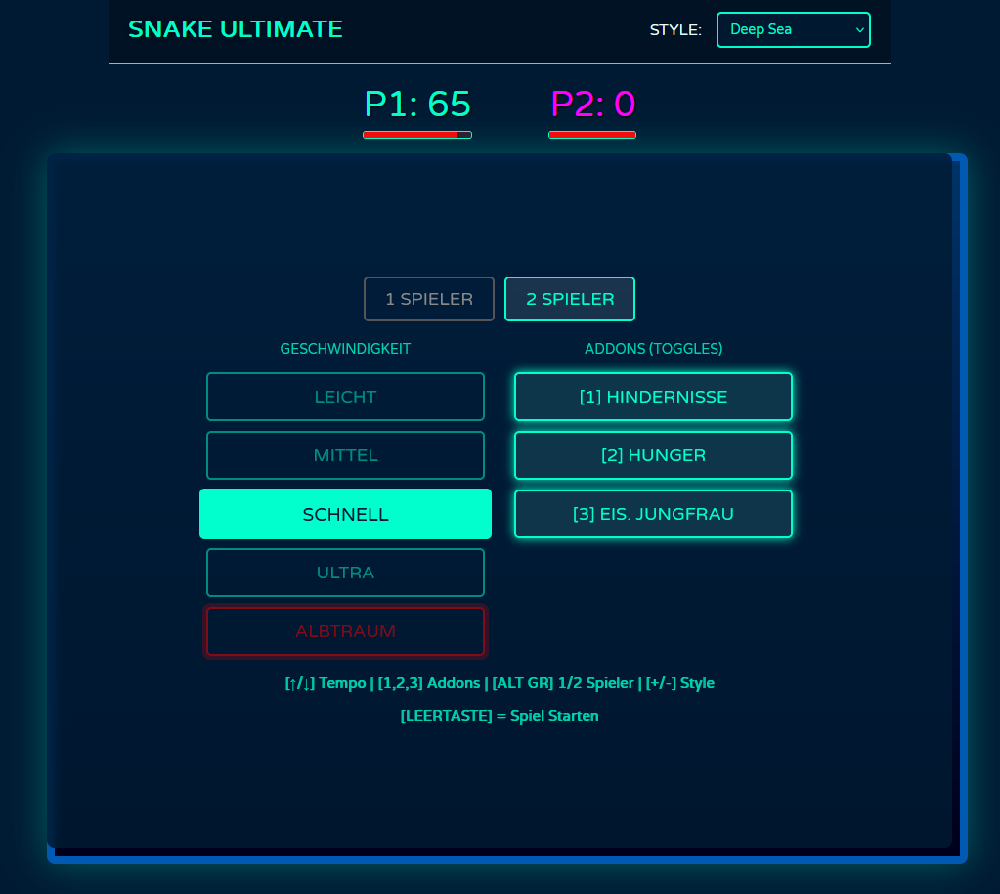
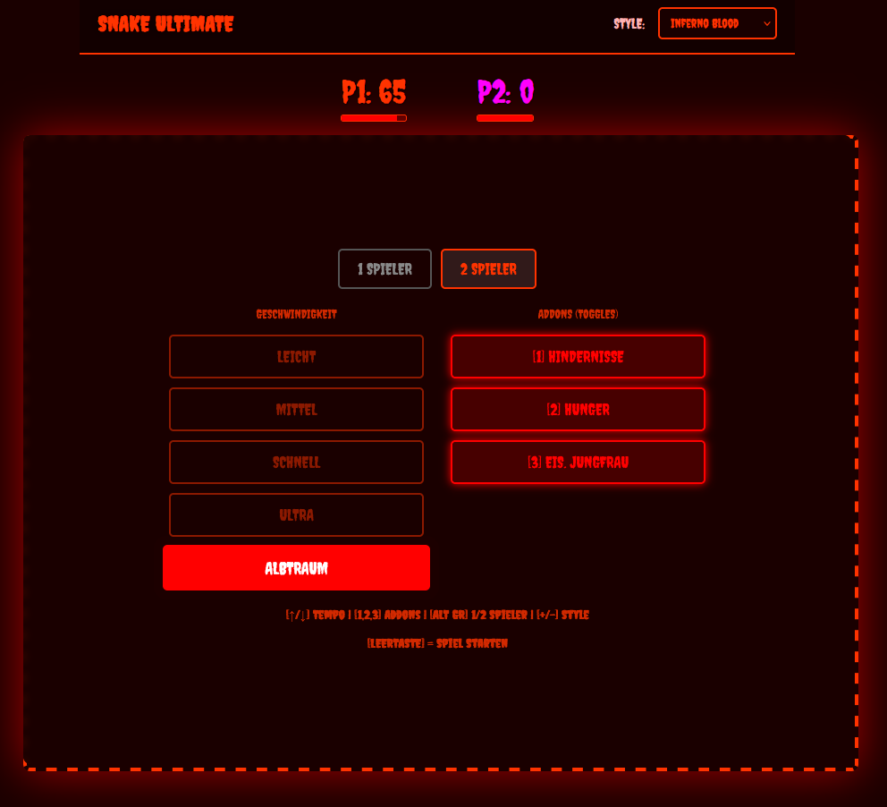

🐍 Snake Ultimate (v0.1)

Snake Ultimate ist eine erweiterte Version des klassischen Arcade-Spiels "Snake". Das Projekt wurde vollständig in HTML5, CSS3 und Vanilla JavaScript entwickelt und kommt ohne externe Frameworks aus.

Es bietet neben dem klassischen Einzelspieler-Modus einen lokalen Multiplayer, verschiedene visuelle Themes und anpassbare Spielmechaniken (Addons).

📸 Screenshots

Das Hauptmenü im "Neon Cyberpunk" Theme.

Das "Classic 3310" Theme.

Das Hauptmenü im "Deep Sea" Theme.

Das Hauptmenü im "Inferno Blood" Theme.

✨ Features

Responsives Design: Das Spielfeld skaliert dynamisch mit der Fenstergröße und behält dabei das 4:3 Seitenverhältnis bei.

Lokaler Multiplayer: Zwei Spieler können gleichzeitig an einer Tastatur spielen. Bei einer Kollision der Schlangenköpfe kommt es zu einem Unentschieden (Double K.O.).

4 Visuelle Themes: Ändern nicht nur die Farbpalette, sondern auch die Rendering-Logik der Objekte und die Schriftarten:

🌐 Neon Cyberpunk: Rasterhintergrund und Neon-Leuchteffekte.

🧱 Classic 3310: Monochromes Grün mit sichtbarem Pixel-Raster.

🌊 Deep Sea: Organische, runde Formen und Tiefsee-Farbverlauf.

🔥 Inferno Blood: Dunkelrote Farbgebung mit gezackten Schlangenmodellen.

Tastaturbedienung: Das gesamte Spiel inklusive Menü lässt sich über die Tastatur steuern.

⚙️ Spielmodi & Addons

Die Spielgeschwindigkeit und zusätzliche Mechaniken lassen sich modular anpassen.

Geschwindigkeiten

Leicht (150ms)

Mittel (100ms)

Schnell (70ms)

Ultra (45ms)

ALBTRAUM (35ms): In diesem Modus sind alle untenstehenden Addons zwingend aktiviert. Zusätzlich wird der Spieler von einem roten Geist verfolgt.

Addons (Toggles)

Die Addons können einzeln zu jedem Standard-Schwierigkeitsgrad hinzugeschaltet werden:

🪨 Hindernisse: Für jedes dritte gesammelte Futter spawnt ein permanentes Hindernis auf dem Spielfeld.

🥩 Hunger: Eine Leiste leert sich kontinuierlich. Ist sie leer, schrumpft die Schlange und es gibt Punktabzug. Fressen füllt die Leiste wieder auf.

🌀 Eiserne Jungfrau: Eine Wand wächst spiralförmig von außen nach innen und verkleinert den Spielbereich. Jedes gesammelte Futter drängt die Wand ein Stück zurück.

🎮 Steuerung

Das Spiel verwendet eine Input-Queue (Tasten-Warteschlange), um Eingabefehler wie sofortige U-Turns bei schnellen Tastenfolgen zu verhindern.

Menüsteuerung

Taste

Aktion

<kbd>Leer</kbd>

Spiel starten / Neustart nach Game Over

<kbd>↑</kbd> / <kbd>↓</kbd>

Geschwindigkeit wechseln

<kbd>Alt Gr</kbd>

Zwischen 1- und 2-Spieler-Modus umschalten

<kbd>+</kbd> / <kbd>-</kbd>

Visuelles Theme wechseln

<kbd>1</kbd>, <kbd>2</kbd>, <kbd>3</kbd>

Addons ein- oder ausschalten

<kbd>Strg</kbd>

Zurück ins Hauptmenü

Spielsteuerung

Spieler

Tasten

Spieler 1

<kbd>↑</kbd> <kbd>↓</kbd> <kbd>←</kbd> <kbd>→</kbd> (Pfeiltasten)

Spieler 2

<kbd>W</kbd> <kbd>A</kbd> <kbd>S</kbd> <kbd>D</kbd>

🚀 Installation & Start

Das Spiel läuft clientseitig im Browser, es wird kein lokaler Server benötigt.

Repository klonen oder herunterladen:

git clone [https://github.com/DaWasteh/snake-ultimate.git](https://github.com/DaWasteh/snake-ultimate.git)

Die Datei index.html in einem modernen Webbrowser (Chrome, Firefox, Edge, Safari) öffnen.

Spiel starten.

🛠️ Entwicklung & Architektur (v0.1)

Bei der Entwicklung wurde auf eine klare Trennung der Rendering-Logik geachtet. Jedes Theme nutzt eine eigene Draw-Funktion, um individuelle Formen (Quadrate, Kreise, Diamanten) performant auf das Canvas zu zeichnen. Zudem ist eine State-Machine implementiert, die den Wechsel zwischen Menü, aktivem Spiel und Game-Over-Status verwaltet.

Geplante Erweiterungen:

[ ] Highscore-Speicherung (Local Storage)

[ ] Soundeffekte

[ ] Mobile Touch-Unterstützung

Entwickelt von DaWasteh.