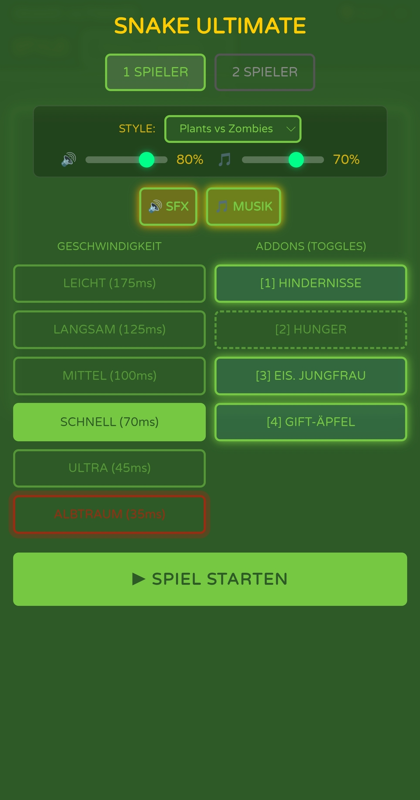

# 🐍 Snake Ultimate (v0.5)

Snake Ultimate ist eine erweiterte Version des klassischen Arcade-Spiels "Snake". Das Projekt wurde vollständig in HTML5, CSS3 und Vanilla JavaScript entwickelt und kommt ohne externe Frameworks aus.

Es bietet neben dem klassischen Einzelspieler-Modus einen lokalen Multiplayer, 8 visuelle Themes und anpassbare Spielmechaniken (Addons) – vollständig optimiert für Desktop, Tablet und Mobile.

---

## 📸 Screenshots


Das Hauptmenü im „Neon Cyberpunk" Theme.


Das „Classic 3310" Theme beim Spielen.


Das Hauptmenü Mobile im "Plants vs Zombies" Theme.

---

## ✨ Features

**Responsives Design:** Das Spielfeld skaliert dynamisch für Desktop, Tablet, Hochformat- und Querformat-Smartphones (16:9, 18:9, 9:16) und behält dabei stets das 4:3-Seitenverhältnis bei.

**Lokaler Multiplayer:** Zwei Spieler können gleichzeitig an einer Tastatur spielen. Bei einer Kollision der Schlangenköpfe kommt es zu einem Unentschieden (Double K.O.).

**8 Visuelle Themes:** Ändern nicht nur die Farbpalette, sondern auch die Rendering-Logik der Objekte und die Schriftarten:

- 🌐 **Neon Cyberpunk:** Rasterhintergrund und Neon-Leuchteffekte.
- 🧱 **Classic 3310:** Monochromes Grün mit sichtbarem Pixel-Raster.
- 🌊 **Deep Sea:** Organische, runde Formen und Tiefsee-Farbverlauf.
- 🔥 **Inferno Blood:** Dunkelrote Farbgebung mit gezackten Schlangenmodellen.
- 🌿 **Plants vs. Zombies:** Grüner Rasen, Sonnenblumen-Food, Zombie-Hindernisse.
- 💻 **Matrix Code:** Terminal-Ästhetik mit Glitch-Effekten und Scanlines.
- 🌸 **Vaporwave:** Retrowave-Perspektivgrid mit Pink/Lila-Palette.
- 🌲 **Dark Forest:** Organische Waldtextur mit roten Schlangenaugen.

**Tastaturbedienung:** Das gesamte Spiel inklusive Menü lässt sich über die Tastatur steuern.

**Touch-Steuerung:** Swipe-Gesten auf dem Spielfeld und On-Screen D-Pad für komfortable mobile Bedienung.

**Pause-Funktion:** Spiel jederzeit pausierbar per Tastatur oder Mobile-Button.

---

## ⚙️ Spielmodi & Addons

Die Spielgeschwindigkeit und zusätzliche Mechaniken lassen sich modular anpassen.

### Geschwindigkeiten

| Modus     | Intervall |
|-----------|-----------|
| Leicht    | 150 ms    |
| Mittel    | 100 ms    |
| Schnell   |  70 ms    |
| Ultra     |  45 ms    |
| ALBTRAUM  |  35 ms    |

**ALBTRAUM:** Alle Addons zwingend aktiv + roter Geist verfolgt die Schlange.

### Addons (Toggles)

| Addon            | Beschreibung |
|------------------|--------------|
| 🪨 Hindernisse   | Für jedes 3. gesammelte Futter spawnt ein permanentes Hindernis. |
| 🥩 Hunger        | Leiste leert sich kontinuierlich. Bei 0: Schlange schrumpft und Punktabzug. Bei Länge 1: nur Score-Abzug, kein sofortiger Tod. Fressen füllt sie wieder. |
| 🌀 Eis. Jungfrau | Wand wächst spiralförmig von außen nach innen. Fressen drückt sie zurück. |
| 🍎 Gift-Äpfel    | Lila Äpfel erscheinen zufällig. Bei Fressen: Score-Abzug + Schlange schrumpft. |

---

## 🎮 Steuerung

### Menüsteuerung

| Taste              | Aktion                             |
|--------------------|------------------------------------|
| `Leertaste`        | Spiel starten                      |
| `↑` / `↓`          | Geschwindigkeit wechseln           |
| `Alt Gr`           | 1- / 2-Spieler-Modus umschalten    |
| `+` / `-`          | Visuelles Theme wechseln           |
| `1`, `2`, `3`, `4` | Addons ein- / ausschalten          |
| `Strg`             | Zurück ins Hauptmenü               |

### Spielsteuerung (Keyboard)

| Spieler   | Tasten                              |
|-----------|-------------------------------------|
| Spieler 1 | `↑` `↓` `←` `→` (Pfeiltasten)      |
| Spieler 2 | `W` `A` `S` `D`                     |
| Pause     | `P` oder `Escape`                   |
| Weiter    | `P`, `Escape` oder `Leertaste`      |

### Mobile Steuerung

| Methode   | Beschreibung                                      |
|-----------|---------------------------------------------------|
| Swipe     | Wischen auf dem Spielfeld (min. 25 px Distanz)    |
| D-Pad     | On-Screen Steuerkreuz erscheint automatisch beim Spielstart |
| Vibration | D-Pad-Buttons geben kurzes haptisches Feedback    |

---

## 🚀 Installation & Start

Das Spiel läuft vollständig clientseitig im Browser, es wird kein lokaler Server benötigt.

```bash
# Repository klonen
git clone https://github.com/DaWasteh/snake-ultimate.git

# Datei im Browser öffnen
open snake_ultimate.html
```

Kompatibel mit allen modernen Browsern: Chrome, Firefox, Edge, Safari (Desktop & Mobile).

---

## 🛠️ Entwicklung & Architektur

### v0.5 – Sound, Controller & Visibility Update

**Bugfixes (aus Bastis Entwicklungsbranch repariert):**
- 🐛 **[KRITISCH]** `stopMusic()` prüfte `!musicEnabled` vor dem Stop → Musik ließ sich nicht ausschalten. Fix: Guard entfernt, nur noch `clearInterval`.
- 🐛 **[KRITISCH]** `musicOscillators.push({})` fügte leere Objekte statt Oscillatoren hinzu → `osc.stop()` warf TypeError. Fix: Array nur für `clearInterval` genutzt, Noten terminieren sich selbst via `osc.stop(currentTime + duration)`.
- 🐛 **[KRITISCH]** `currentMode` wurde in `startGame()` nie auf `'nightmare'` gesetzt → Nightmare-Musik spielte nie. Fix: `currentMode` wird jetzt korrekt beim Spielstart gesetzt.
- 🐛 **[KRITISCH]** Gamepad-Achsenlogik grundlegend falsch – `Math.abs()` verlor Vorzeichen, `axes[4–7]` existieren nicht auf Standard-Controllern. Fix: Korrekte Vorzeichenprüfung auf `axes[0/1]` (P1) und `axes[2/3]` (P2), D-Pad via `buttons[12–15]`.
- 🐛 `saveAudioSettings()` war doppelt deklariert (Zeile 922 und 1388) → zweite Deklaration überschrieb erste. Duplikat entfernt.
- 🐛 Dark Forest Maiden-Block hatte 0-Einrückung (aus Funktions-Body „herausgefallen"). Einrückung korrigiert.

**Features:**
- ✅ **Sound Engine (Web Audio API):** 8-Bit Synth mit Square-, Sawtooth-, Triangle-Wave und Noise-Generator.
- ✅ **Soundeffekte:** Fressen, Gift-Apfel, Crash (Wall/Body/Obstacle/Maiden/Hunter), Pause, Resume, Game Over – jeweils eigene Varianten für Normal- und Nightmare-Modus.
- ✅ **8-Bit Hintergrundmusik:** Loopender Sequencer via `setInterval`, theme-sensitiv (Normal vs. Nightmare), startet automatisch mit Spielstart.
- ✅ **Audio-Toggles im Menü:** `🔊 SFX` und `🎵 MUSIK` Buttons mit visuellem Aktivzustand. Lautstärke-Slider (0–100%) für SFX und Musik separat. Einstellungen werden in `localStorage` persistiert.
- ✅ **Keyboard-Shortcuts für Audio:** `[M]` = Mute, `[S]` = SFX toggle, `[U]` = Musik toggle (nur außerhalb von PLAYING).
- ✅ **Controller-Support (Gamepad API):** Linker Stick + D-Pad-Buttons (P1), rechter Stick (P2 im Multiplayer). Start/Select = Pause/Resume.
- ✅ **Gitterlinien-Sichtbarkeit erhöht:** Cyberpunk (0.05→0.3 Opacity, 1→2px), Matrix (0.04→0.25 Opacity, +Scanlines verstärkt), Vaporwave (0.25→0.4 Opacity, Perspektivgrid doppelt gezeichnet), Retro (zusätzliches Pixel-Raster).
- ✅ **Eiserne Jungfrau Sichtbarkeit erhöht:** Alle 8 Themes mit stärkerem Glow (`shadowBlur` erhöht), dickeren Rahmen (1→3px), ausgefüllten Blöcken mit Leuchte-Overlay.
- ✅ **Neue Geschwindigkeitsmodi:** LEICHT 175ms (war 150ms), neu: LANGSAM 125ms – insgesamt 6 Stufen.

### v0.4 – Performance & Balance Update

Basierend auf einer systematischen Codeanalyse wurden kritische Bugs behoben, die Game Loop performanter gestaltet und neue Komfort-Features ergänzt.

**Bugfixes:**
- 🐛 **[KRITISCH]** Hunger-Addon tötete die Schlange sofort bei Länge 1 → Jetzt: Score-Abzug und Hunger-Reset bei Minimallänge, kein sofortiger Tod.
- 🐛 Eiserne Jungfrau-Spiralfortschritt (`maidenProgress`) wurde nach Spielende nicht zurückgesetzt → Fix in `endGame()`.
- 🐛 Gift-Äpfel-Spawn wurde nur alle 35 Ticks geprüft (Batch-Effekt) → Jetzt gleichmäßige `1/35`-Wahrscheinlichkeit pro Tick.

**Performance:**
- ✅ Game Loop auf `requestAnimationFrame` umgestellt (war `setInterval`) → Kein Timer-Jitter mehr bei hoher CPU-Last, synchron mit Display-Refresh.

**Features:**
- ✅ **Pause-Funktion:** `[P]` oder `[ESC]` pausiert das Spiel. `[P]`/`[ESC]`/`[Leertaste]` setzt fort. Auf Mobile: „▶ WEITER"-Button im Pause-Overlay.
- ✅ **Haptisches Feedback:** D-Pad-Buttons auf mobilen Geräten mit `navigator.vibrate(5)` Kurzvibrierung bei Antippen.

### v0.3 – Themes Expansion

**Neue Themes:**
- ✅ Matrix Code Theme (Terminal-Ästhetik, Glitch-Food, Scanline-Overlay)
- ✅ Vaporwave Theme (Retrowave-Perspektivgrid, pulsierendes Stern-Food)
- ✅ Dark Forest Theme (Prozedurale Baumtextur via `forestRng()`, Pilz-Giftäpfel)

**Neue Addons:**
- ✅ Gift-Äpfel ([4] GIFT-ÄPFEL) mit theme-spezifischem Rendering und Pulsiereffekten

### v0.2 – Bugfixes & Mobile Overhaul

**Bugfixes:**
- 🐛 **[KRITISCH]** `showMenu()` fügte bei jedem Aufruf neue Event-Listener auf den Start-Button → `startGame()` wurde mehrfach aufgerufen.
- 🐛 **[KRITISCH]** Overlay war `position: absolute` → auf Landscape-Phones nur ~250px hoch, abgeschnitten.
- 🐛 Swipe-Erkennung fehlte Mindestabstand-Check.
- 🐛 `resizeCanvas()` CSS/JS-Größenkonflikt auf Mobile.
- 🐛 Doppelter `@media (max-width: 600px)` Block (140 Zeilen redundant).
- 🐛 PvZ-Theme war implementiert aber nicht im Dropdown.

**Mobile Improvements:**
- ✅ Overlay auf Touch-Geräten `position: fixed; inset: 0`.
- ✅ Separate CSS-Breakpoints für Portrait (≤600px) und Landscape (max-height: 500px).
- ✅ `touch-action: manipulation` auf allen Buttons.
- ✅ On-Screen D-Pad mit automatischer Multiplayer-Erkennung.
- ✅ `viewport-fit=cover` + `user-scalable=no` für Notch-Geräte.

### v0.1 – Initiale Version

Klare Trennung der Rendering-Logik pro Theme. State-Machine (MENU → PLAYING → GAMEOVER). Input-Queue verhindert sofortige U-Turns.

---

## 📋 Geplante Erweiterungen

- [ ] Sound- & Visual-Design Verbesserungen
- [ ] Mobile Qwerformat Skalierung Spielfeld verbessern

---

Entwickelt von **DaWasteh**.